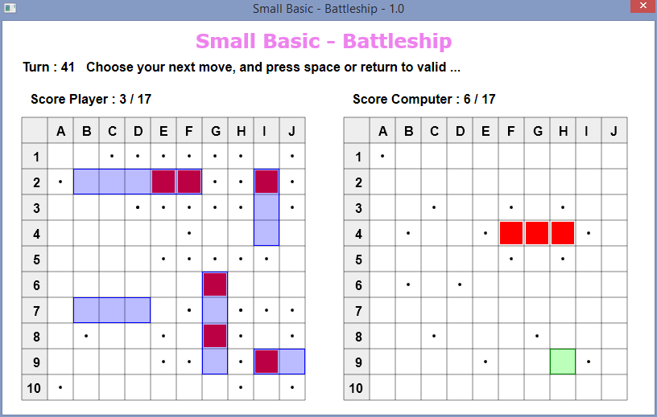

# Small Basic Game : Battleship

From the Small Basic "[Challenge of the month - March 2015](https://social.msdn.microsoft.com/Forums/en-US/45bf1aee-1fa3-4d21-90b5-b6b931d6d273/challenge-of-the-month-march-2015?forum=smallbasic)" I created the game of the Battleship where you play against the computer.

The file contains the source code and the executable. You can import it in Small basic to : [MRV593-2](http://smallbasic.com/program/?MRV593-2)

I provide this source code also has educational purposes, also tried to make a code easy to read and with a lot of comments.

I wrote an article on the TechNet wich explains with more detail how this code works : http://social.technet.microsoft.com/wiki/contents/articles/30386.small-basic-the-battleship-game-in-detail.aspx

